## 实验题目

1. 按照 Hadoop 安装运行说明文档中的指导，自己搭建伪分布式 Hadoop 环境，熟悉 HDFS 的常用操作，运行 WordCount 程序，得到统计结果
2. 实现一个统计输入文件中各个长度的单词出现频次的程序

## 实验环境

- CPU:Xeon(R) Silver 4116
- 内存:255G
- 操作系统:Ubuntu 20.04
- 软件平台:Hadoop 分布式文件系统, openjdk 1.8.0_292

## 实验内容

### 安装运行 Hadoop

从 Ubuntu 20.04 官方源中装了 openjdk 1.8.0_292

参照 Hadoop 的官方文档：<https://hadoop.apache.org/docs/r1.0.4/cn/quickstart.html>，先从科大镜像站下载 Hadoop 的安装包：<http://mirrors.ustc.edu.cn/apache/hadoop/common/hadoop-3.2.2/hadoop-3.2.2.tar.gz>，之后再释放路径

```bash
$ ssh-keygen
$ cp ~/.ssh/id_rsa.pub ~/.ssh/authorized_keys
# 配置自我连接
$ export JAVA_HOME=/usr/lib/jvm/java-8-openjdk-amd64
$ tar zxf hadoop-3.2.2.tar.gz
$ hadoop-3.2.2/bin/hadoop version
Hadoop 3.2.2
Source code repository Unknown -r 7a3bc90b05f257c8ace2f76d74264906f0f7a932
Compiled by hexiaoqiao on 2021-01-03T09:26Z
Compiled with protoc 2.5.0
From source with checksum 5a8f564f46624254b27f6a33126ff4
This command was run using /home/totoro/hadoop-3.2.2/share/hadoop/common/hadoop-common-3.2.2.jar
```

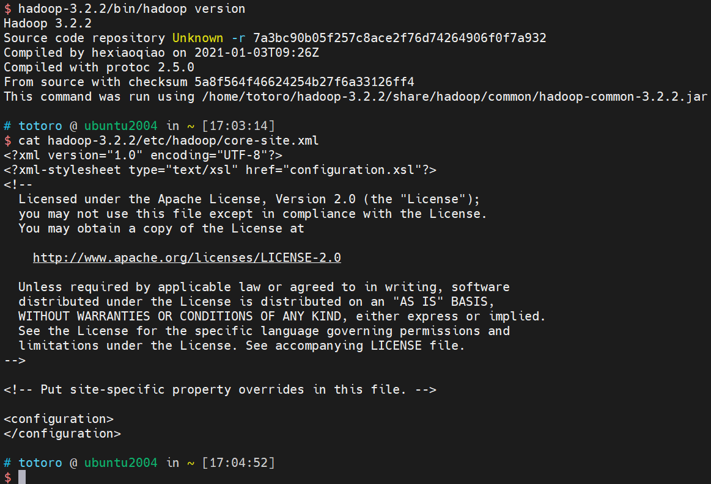

配置 Hadoop 伪分布式，修改 core-site.xml 和 hdfs-site.xml 两个配置，如图

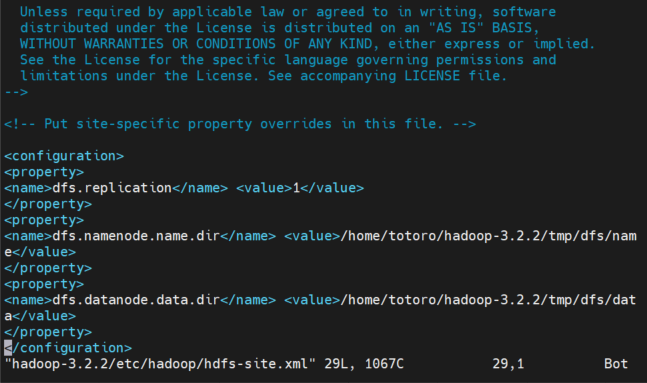

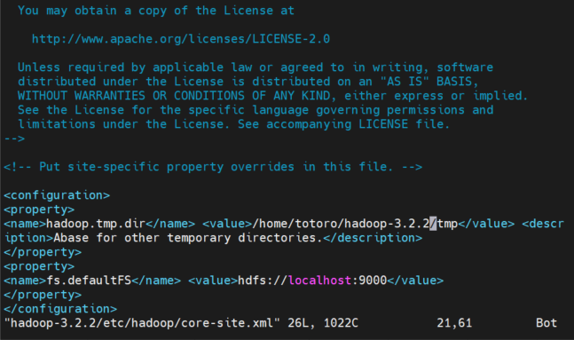

再修改 hadoop-env.sh，加上 JAVA_HOME 环境变量的设置

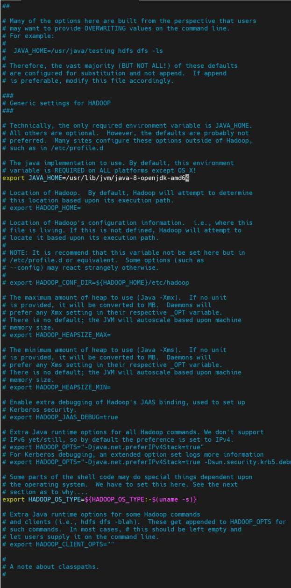

运行 `bin/hdfs namenode -format` 命令后，输出 namenode 格式化的结果，如图

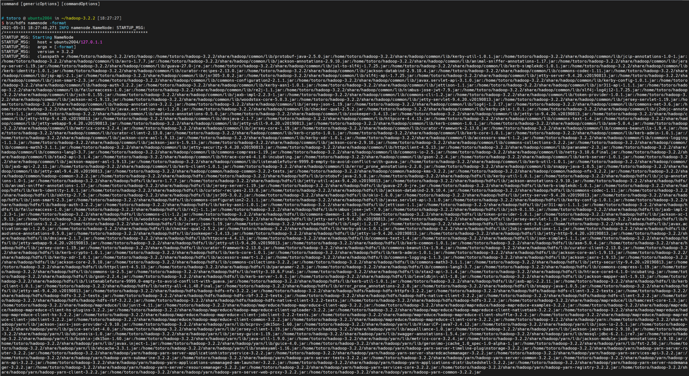

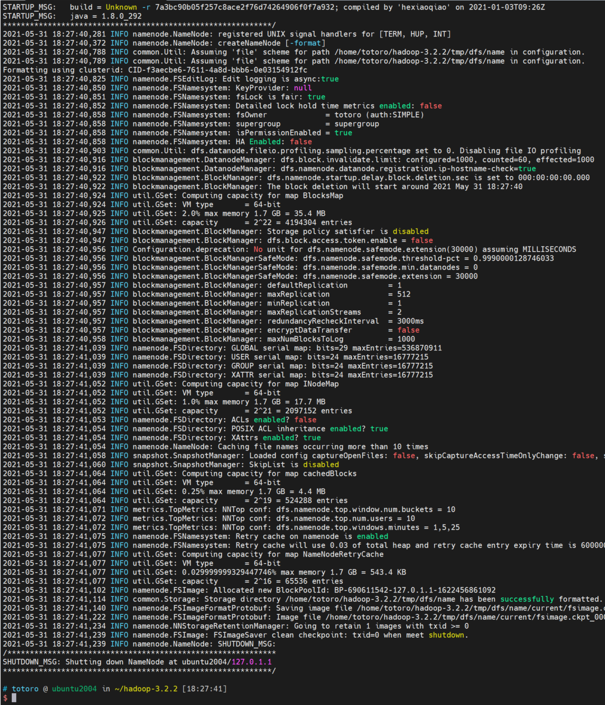

运行 `sbin/start-dfs.sh` 命令，运行 hdfs，如图

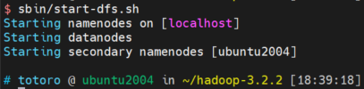

创建 hdfs 内的文件夹

```bash
$ hadoop-3.2.2/bin/hdfs dfs -mkdir -p hdfs
$ hadoop-3.2.2/bin/hdfs dfs -mkdir hdfs/input
$ hadoop-3.2.2/bin/hdfs dfs -ls /
Found 1 items
drwxr-xr-x   - totoro supergroup          0 2021-05-31 18:47 /user
$ hadoop-3.2.2/bin/hdfs dfs -ls /user
Found 1 items
drwxr-xr-x   - totoro supergroup          0 2021-05-31 18:47 /user/totoro
$ hadoop-3.2.2/bin/hdfs dfs -ls /user/totoro
Found 1 items
drwxr-xr-x   - totoro supergroup          0 2021-05-31 18:48 /user/totoro/hdfs
$ hadoop-3.2.2/bin/hdfs dfs -ls /user/totoro/hdfs
Found 1 items
drwxr-xr-x   - totoro supergroup          0 2021-05-31 18:48 /user/totoro/hdfs/input
```

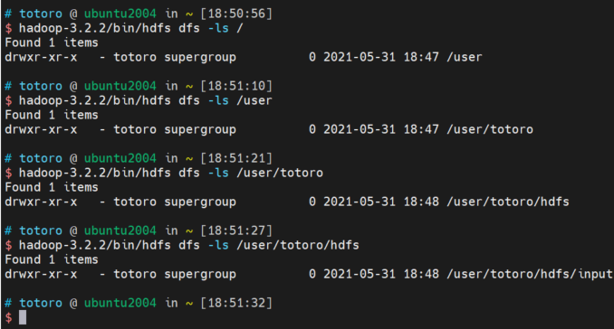

将主机上文件转移至 hdfs 内

```bash
$ hadoop-3.2.2/bin/hdfs dfs -put hadoop-3.2.2/etc/hadoop/*.xml hdfs/input
$ hadoop-3.2.2/bin/hdfs dfs -ls /user/totoro/hdfs/input
Found 9 items
-rw-r--r--   1 totoro supergroup       9213 2021-05-31 18:59 /user/totoro/hdfs/input/capacity-scheduler.xml
-rw-r--r--   1 totoro supergroup       1022 2021-05-31 18:59 /user/totoro/hdfs/input/core-site.xml
-rw-r--r--   1 totoro supergroup      11392 2021-05-31 18:59 /user/totoro/hdfs/input/hadoop-policy.xml
-rw-r--r--   1 totoro supergroup       1067 2021-05-31 18:59 /user/totoro/hdfs/input/hdfs-site.xml
-rw-r--r--   1 totoro supergroup        620 2021-05-31 18:59 /user/totoro/hdfs/input/httpfs-site.xml
-rw-r--r--   1 totoro supergroup       3518 2021-05-31 18:59 /user/totoro/hdfs/input/kms-acls.xml
-rw-r--r--   1 totoro supergroup        682 2021-05-31 18:59 /user/totoro/hdfs/input/kms-site.xml
-rw-r--r--   1 totoro supergroup        758 2021-05-31 18:59 /user/totoro/hdfs/input/mapred-site.xml
-rw-r--r--   1 totoro supergroup        690 2021-05-31 18:59 /user/totoro/hdfs/input/yarn-site.xml
```

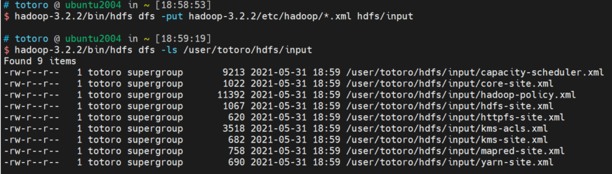

运行了 `hadoop-3.2.2/bin/hadoop jar WordCount.jar grep hdfs/input output` 程序，成功运行字数记录程序，output 里结果如 word-count 所示

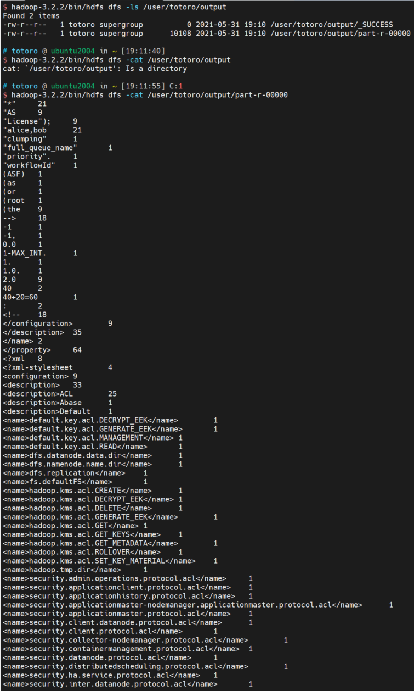

从 HDFS 中取出运行的结果

```bash
$ hadoop-3.2.2/bin/hadoop fs -get output/part-r-00000 .
$ ls
gost  hadoop-3.2.2  part-r-00000  WordCount.jar
$ head part-r-00000
"*"     21
"AS     9
"License");     9
"alice,bob      21
"clumping"      1
"full_queue_name"       1
"priority".     1
"workflowId"    1
(ASF)   1
(as     1
```

### 在 Hadoop 中统计输入文件中各个长度的单词出现频次

根据 WordCount.jar，实现 LenCount.jar 程序运行 Map-Reduce 运算，output 里输出的结果如下

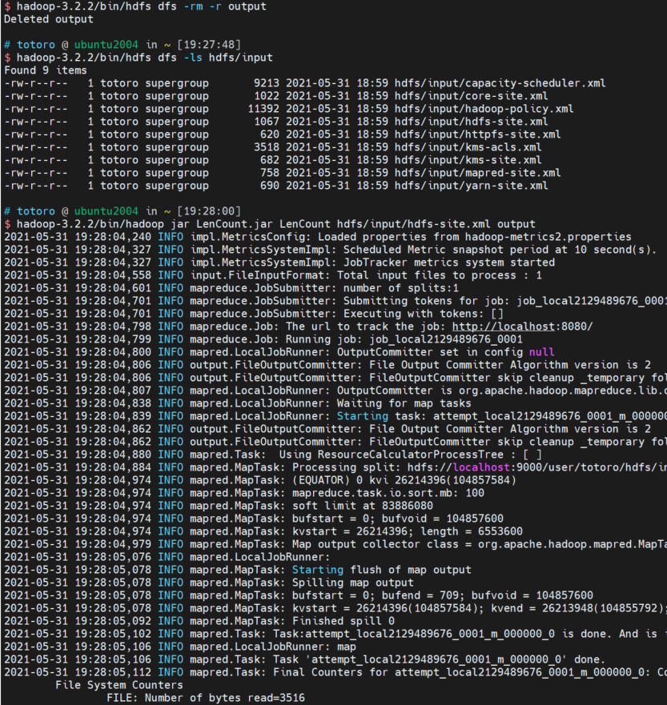

```bash
$ hadoop-3.2.2/bin/hdfs dfs -cat output/part-r-00000
1       1
10      7
11      8
12      1
13      2
15      2
16      3
18      1
2       14
26      1
28      1
3       25
34      2
4       8
42      1
5       7
53      2
6       7
7       7
8       11
9       2
```

实验结束后关闭 Hadoop 程序

```bash
$ hadoop-3.2.2/sbin/stop-dfs.sh
Stopping namenodes on [localhost]
Stopping datanodes
Stopping secondary namenodes [ubuntu2004]
```
